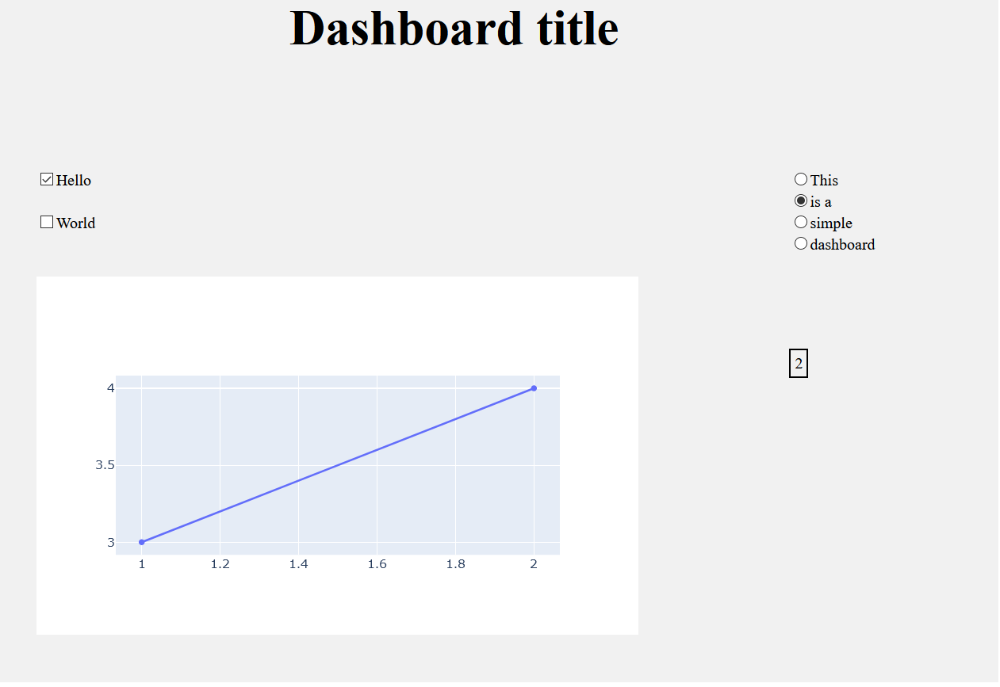

# Simple dashboard template

This is a template of a dashboard in Dash Python framework. It contains 4 files:

- main.py - main file of the application
- layout.py - file where the layout is to be created
- logic.py - backend of the application
- funcs.py - file with custom functions which are to be used in the application

This template contains two simple inputs and two outputs.

